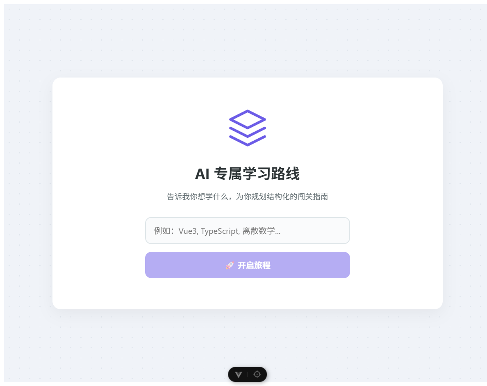
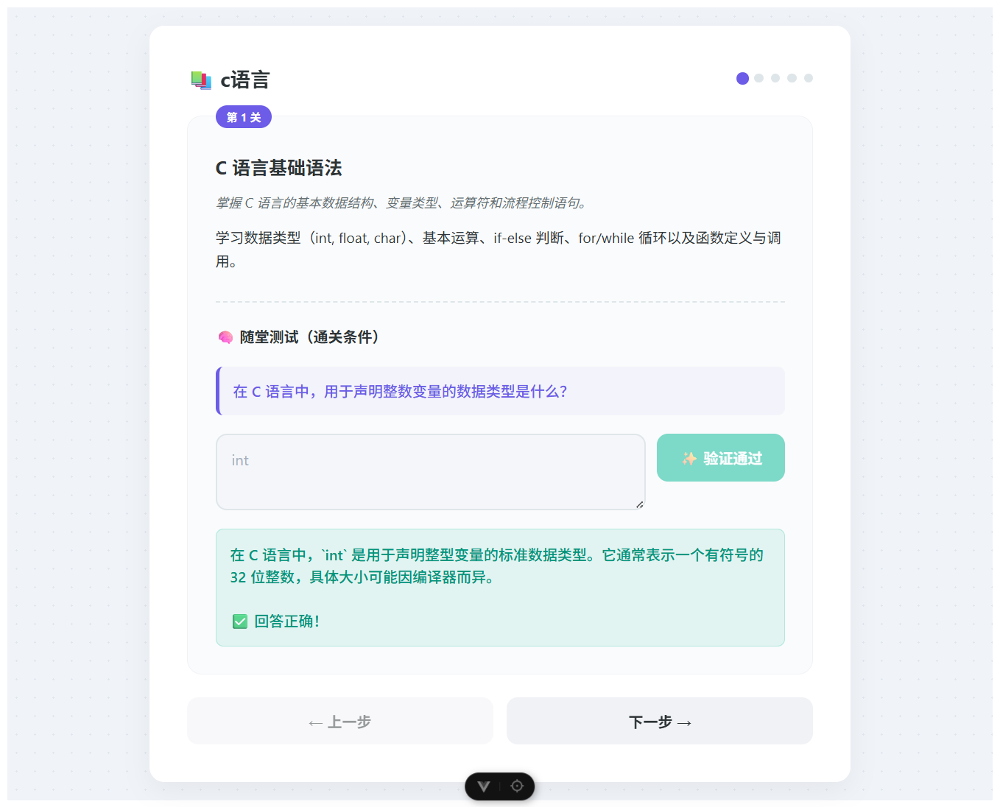

# Agent Learning Helper Frontend

Agent Learning Helper Frontend 是一个智能学习伙伴的前端，用于与智能体的交互

## 技术栈

- Vue
- Typescript

## 安装依赖

```bash
npm install
```

## 配置

```bash
cp .example.env .env
```

## 配置变量

```
VITE_BACKEND_URL=
```

## 运行

```bash
npm run dev
```

## 启动

在浏览器上打开 `http://localhost:5173` 访问

## 示例图片




## 📄 许可证

本项目采用 MIT 许可证。
